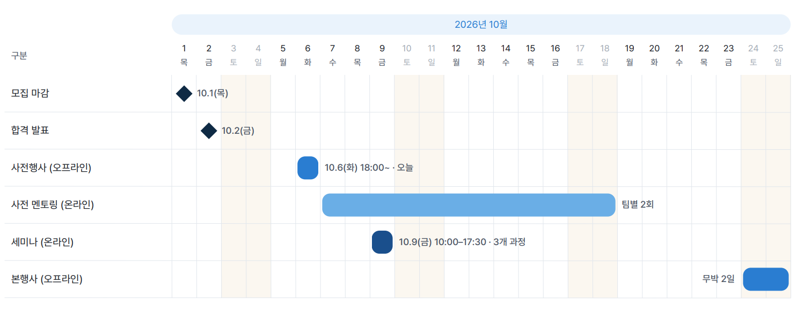

# ict_makerton_2026

배재대에서 진행하는 메이커톤 300seconds 저장소

## 팀원

- 최수길 : 팀장, 개발자, 기획자
- 강민우 : 기획자
- 권리원 : 디자이너
- 최요섭 : 개발자

## 팀명

```text
300초, 단 5분이라는 짧은 시간 안에 서로 다른 생각을 하나로 융합해 결과를 만들어내겠다는 의미를 담았습니다.
저희는 처음 만나서도 5분이면 융합이 끝나는 팀입니다.

저희 팀의 강점은 세 가지입니다.
첫째, 밤을 잘 샙니다. 끝까지 결과물을 만들어낼 체력이 있습니다.
둘째, 전공이 모두 다릅니다. 그래서 같은 문제를 서로 다른 시각에서 바라볼 수 있습니다.
셋째, 고민이 길지 않습니다. 일단 결정하면 바로 실행합니다.

저희 팀은
건축학과의 디자인 감각,
컴퓨터공학의 개발력,
그리고 재직자의 현실적인 센스와 경험이 융합된 팀입니다.

아이디어만 좋은 팀이 아니라,
디자인하고, 개발하고, 실제로 쓸 수 있는 형태까지 빠르게 만들어내겠습니다.

생각은 짧게, 실행은 빠르게.
300 Seconds입니다. 감사합니다.
```

## 일정



