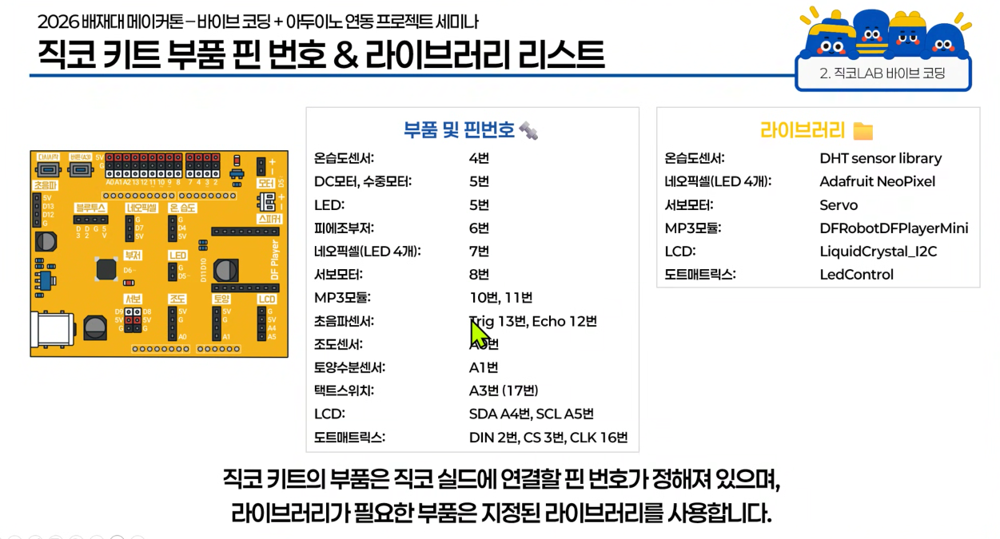
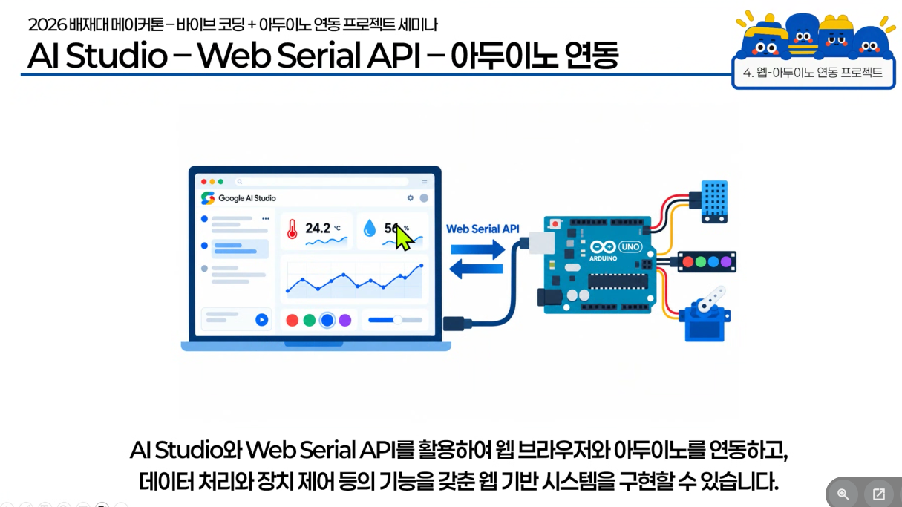
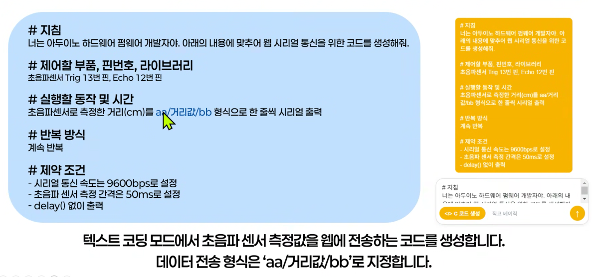

# 직코 LAB 운용 방법

## 직코 설치

- 직코LAB 2.0.4 Setup.exe
- 네이버 사이트로 이동해서 파일을 다운 로드 받음
- license 번호 : JIKKO-A3JU-4EPB-BQLM

- web Serial API

- google AI Studio 를 이용해서 web Serial API를 이용해서 아두이노와 통신 가능

- 실습
  - 

- 최종 산출물
- [최종 산출물](https://arduino-serial-distance-monitor.ai.studio/)