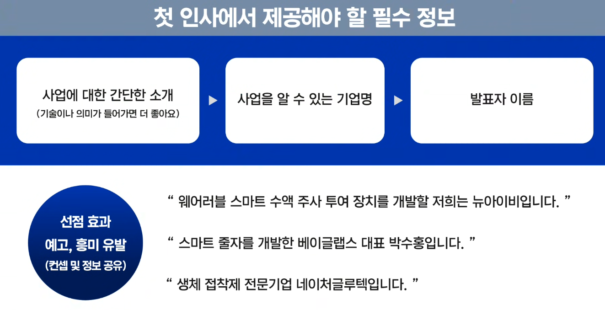
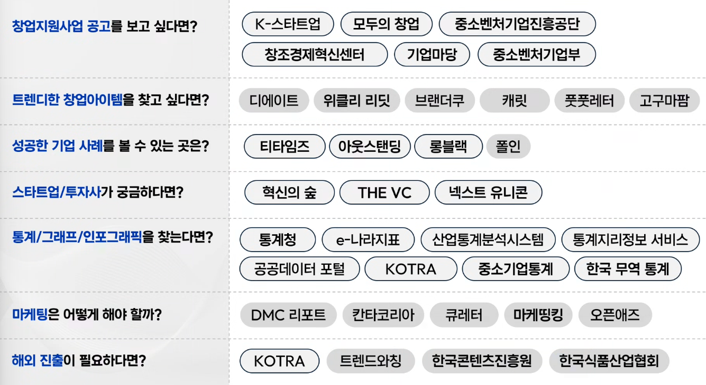
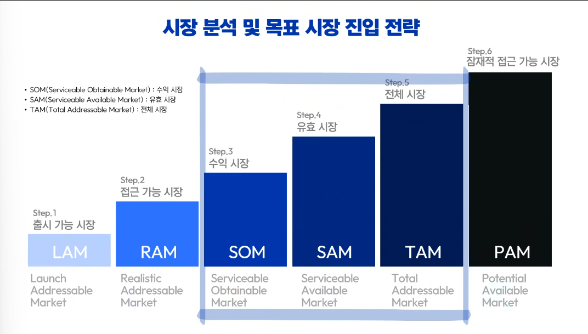
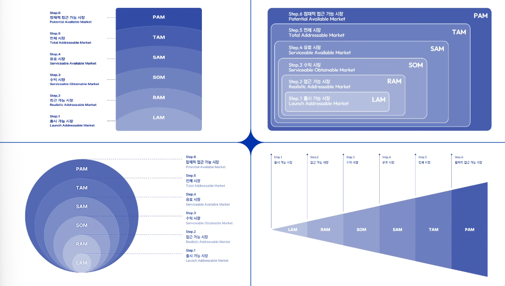
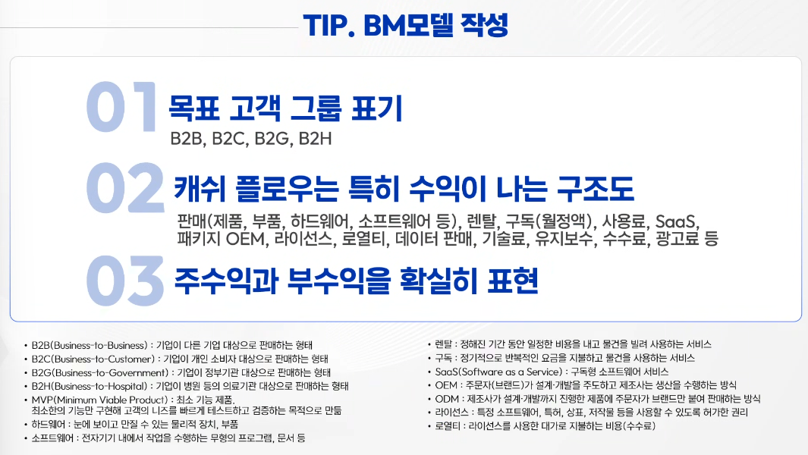
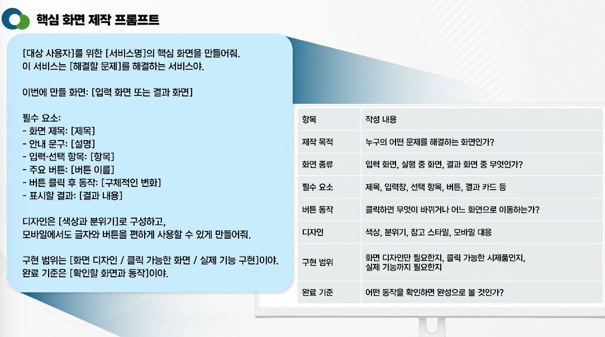
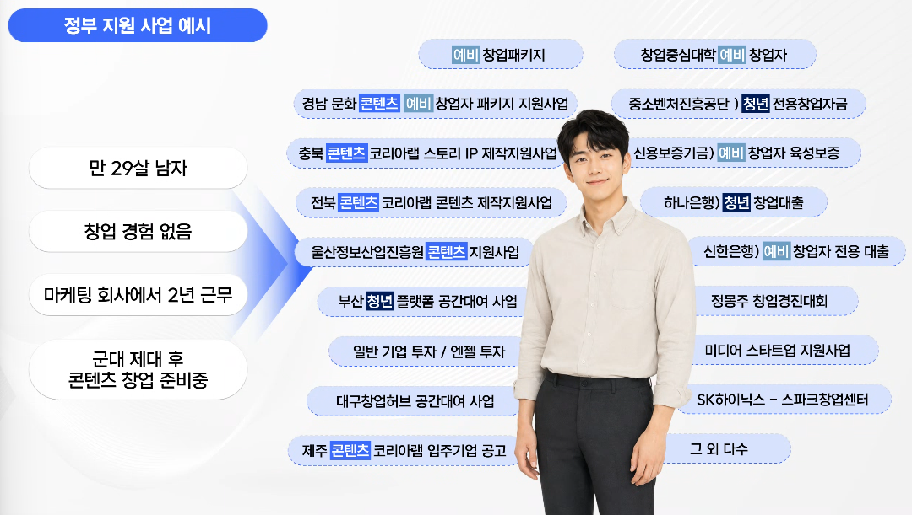

# 발표스킬

---

## 투자 유치를 위한 발표스킬

- IR 피칭

- 심사자는 여러분의 이야기를 잘 듣지 않는다.
  - 라포 형성
  - 호기심 자극
  - 예고 효과
- 발표 구조
  - Hook: 관심을 끌어라
  - Problem: 문제를 정의하라
  - Solution: 해결책을 제시하라
  - Market: 시장을 설명하라
  - Business Model: 수익 모델을 보여라
  - Competition: 경쟁 상황을 설명하라
  - Team: 팀을 소개하라
  - Financials: 재무 계획을 보여라
  - Ask: 투자 요청을 하라

- 출처 확인하기

- 실현 가능성
  - 제품과 서비스의 존재 이유
  - 시연 영상

- 경쟁사 분석 및 차별성
  - 경쟁사와 비교하는 표
  - 제품이 도입된 것과 아닌것의 고객의 불편을 해결하는 표

- 스케일업
  - BM 모델, 시장규모, 시장 진입 방법 영업, 마케팅
  - 기업성과 및 특허 자금 조달 계획, 자금 활용 계획, 마일스톤

- 시장의 규모를 나누어서 프롬프트로 사업 계획서를 쓰는게 좋다
- BM 모델

- 팀 역량의 가치
  - 관련된 경력, 학력
  - 인프라
  - 협업 기업
- ESG 경영
  - 대표의 기업가 정신과 관점이 중요
  - 페이지 마다 명확한 메시지가 들어가고 한눈에 보여 지는게 좋다

010-7110-8640
772ryo@naver.com
티엔티 스피치